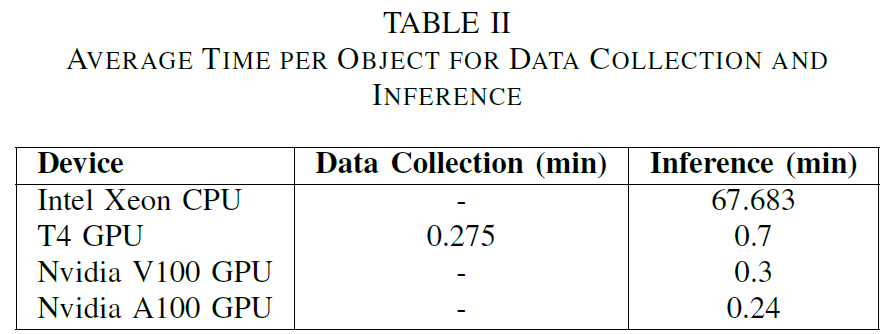

# Learning Shape representations for 3D Reconstruction

This work aims to perform closed 3D reconstructions of items such as the can, mug,
bowl, and camera. These objects are primarily sourced
from ShapeNet, to implement a deep neural network
capable of mapping 3D points to their signed distances
from the surfaces of true 3D shapes. The project includes the training of an auto decoder from
scratch to test the replicated model’s capability to reconstruct
objects when provided with partial viewpoints.

**Keywords**: 3D Computer vision, 3D reconstruction, Deep learning, implicit shape representation

## **ARCHITECTURE**

The network architecture
closely emulated DeepSDF, utilizing the auto-decoder.
However, specific modifications were implemented. The
dimensions were adjusted to 256 for training and 64
for reconstruction, deviating from the original 512 and
128, respectively. A comprehensive comparison of our
network architecture against the original is delineated in
Table.

This model accurately approximates the continuous
SDF from point samples by the usage of a multilayer
fully connected neural network architecture, where
each layer features ReLu activation functions, except the
output function. The output function uses a tanh nonlinearity.
This network is trained using the select classes
of objects from ShapeNet data set, where each sample
is associated with its signed distance value. The sum of
L1 losses between the predicted SDFs and the true values
with clamped L1 loss function introducing a δ parameter
is used as the objective function for training. This δ
parameter is crucial as it defines the influence range
around the objects surface, within which the network
learns the SDF accurately.

## **DATASET**
To collect Signed Distance
Functions (SDFs), we followed the method from
the original DeepSDF paper[4]. However, due to computational
concerns, we opted for 10,000 points per object,
instead of the original 200,000.

In our experiments, data collection time using the
Nvidia T4 GPU amounted to approximately 3.6 hours
(220.7 minutes). Notably, reconstructions were significantly
faster when performed on the GPU compared to
the CPU.

## **TRAINING**
Apart from the hyperparameters, the
orignal implementation seemed to have collected
200,000 SDF samples and sub-sample 16,384 for each
optimization iteration while training. Due to the computational
limitations, we use the 10,000 collected SDF
samples as is in every iteration.

The training process for specific objects exhibited
varying durations. Training models for Airplane, Bowl,
Can, and Camera collectively consumed a total of 886.53
minutes on the single Nvidia A100 GPU. Additionally,
the training of the Mug model took a total of 188.43 minutes
on the Nvidia V100 GPU. A total of about 18 hours
was spent on training all the object categories. These
findings highlight the efficiency and speed advantages
associated with GPU acceleration in our experimental

## **INFERENCE**

## **RESULTS**

We showcase a selection of our
best reconstructions, featuring the ground truth on the
left with the corresponding reconstructed object on the
right. Our implementation effectively captures the overall
shape of the objects, though it appears to exhibit a
tendency toward over-smoothing.

## **CONCLUSION**
To summarize the results of our implementation compared
to the original implementation of DeepSDF, we
found our model was rather lacking at representing sharp
edges of objects at a high resolution, tending to smooth
any abrupt curvature. This decrease in performance was
expected given the fact that we had halved the model
architecture size and ran a significantly smaller amount
of epochs. DeepSDF is great at implicitly representing
the latent space of objects given enough time to train it
and a large and robust dataset. 