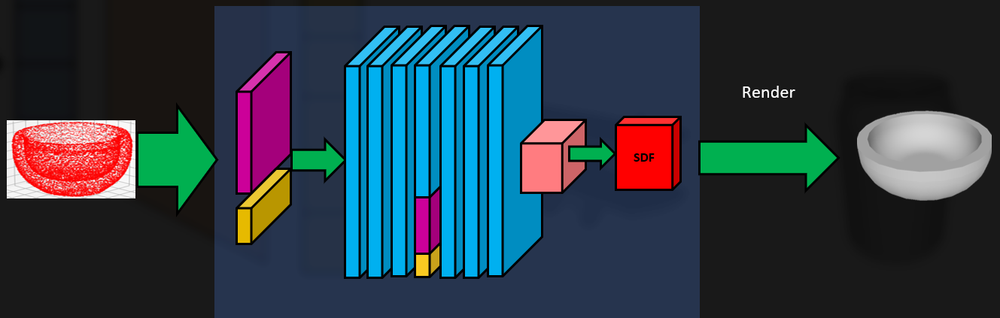
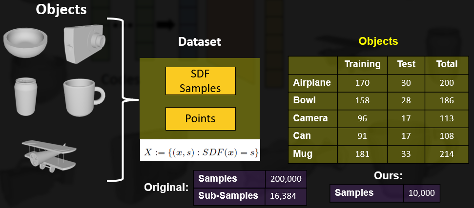
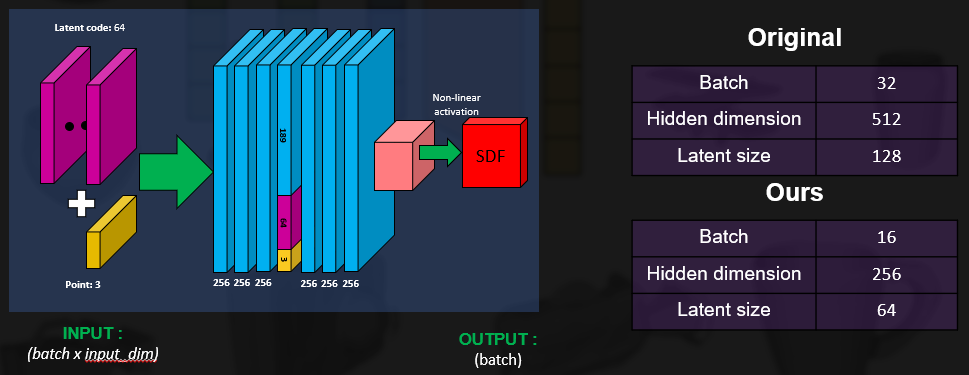
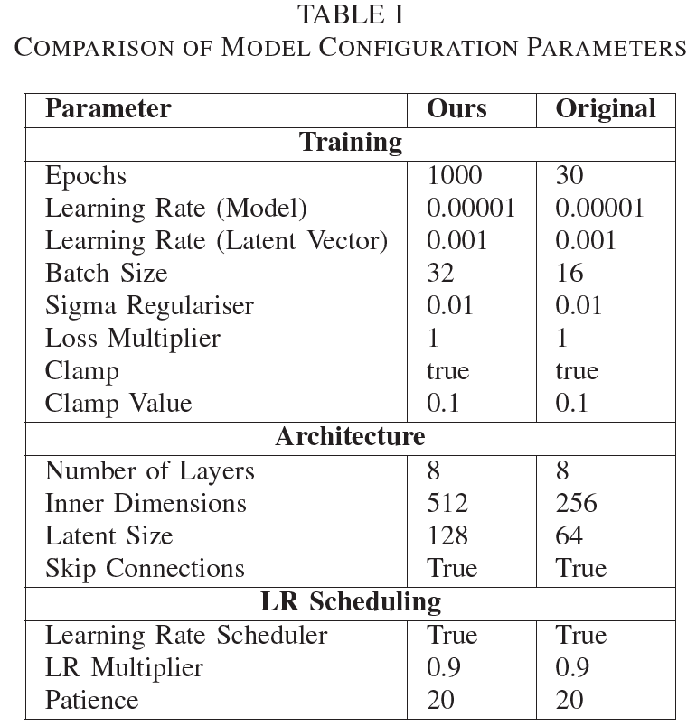
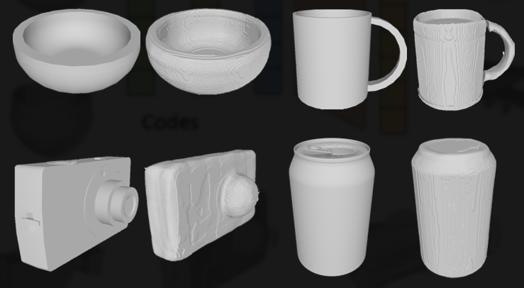

# Learning Shape representations for 3D Reconstruction

This work aims to perform closed 3D reconstructions of items such as the can, mug,
bowl, and camera. These objects are primarily sourced
from ShapeNet, to implement a deep neural network
capable of mapping 3D points to their signed distances
from the surfaces of true 3D shapes. The project includes the training of an auto decoder from
scratch to test the replicated model’s capability to reconstruct
objects when provided with partial viewpoints.

**Keywords**: 3D Computer vision, 3D reconstruction, Deep learning, implicit shape representation

## **DATASET**

## **ARCHITECTURE**
This model accurately approximates the continuous
SDF from point samples by the usage of a multilayer
fully connected neural network architecture, where
each layer features ReLu activation functions, except the
output function. The output function uses a tanh nonlinearity.
This network is trained using the select classes
of objects from ShapeNet data set, where each sample
is associated with its signed distance value. The sum of
L1 losses between the predicted SDFs and the true values
with clamped L1 loss function introducing a δ parameter
is used as the objective function for training. This δ
parameter is crucial as it defines the influence range
around the objects surface, within which the network
learns the SDF accurately.

## **TRAINING**

## **RESULTS**

